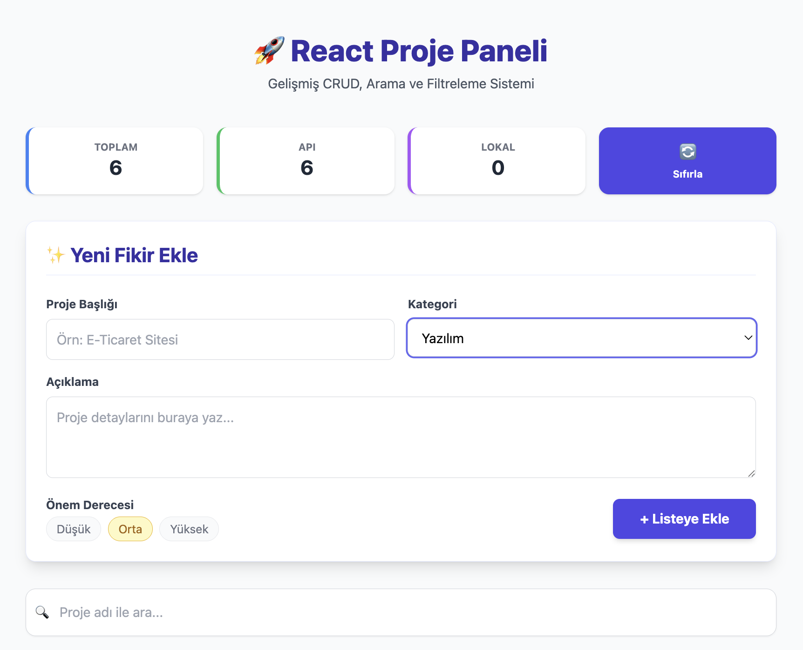
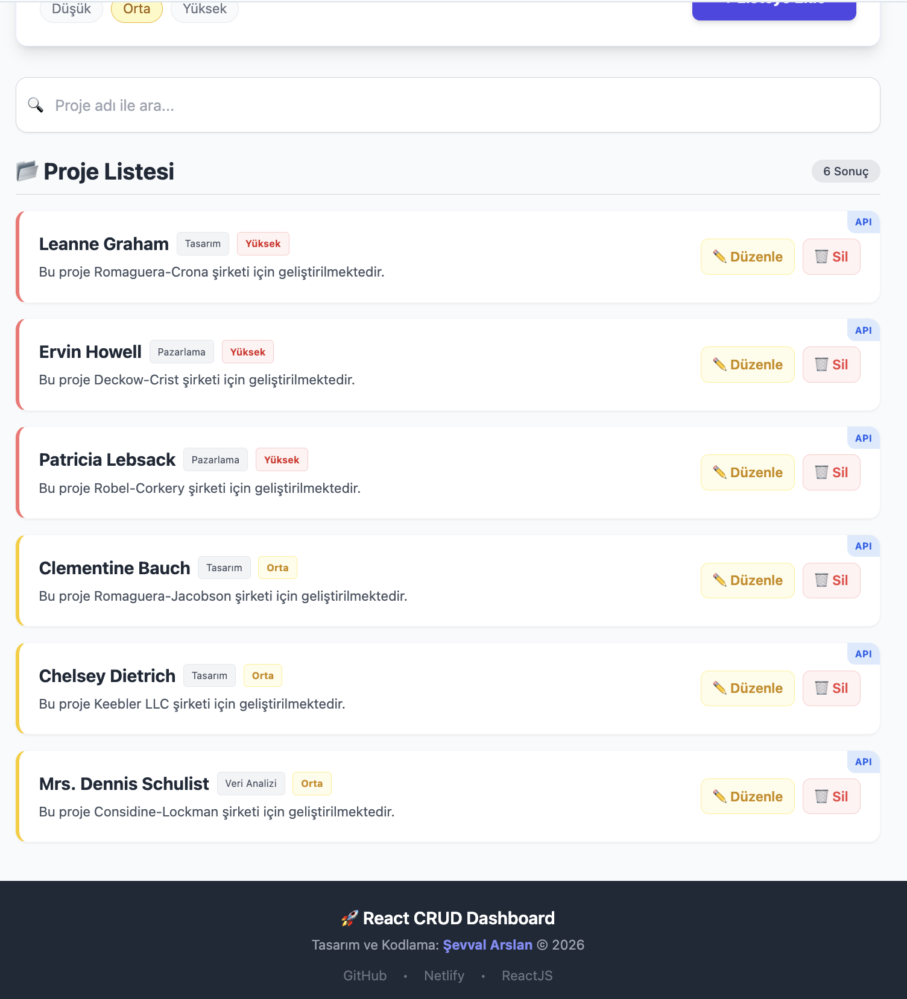

# 🚀 React Proje Takip & Yönetim Paneli

> **Web Geliştirme Eğitimi** kapsamında ReactJS, Tailwind CSS ve Modern JavaScript teknikleri kullanılarak geliştirilmiş kapsamlı bir CRUD uygulamasıdır.



## 🔗 Canlı Demo
Uygulamayı buradan test edebilirsiniz: [https://dancing-mermaid-e3f22e.netlify.app/](https://dancing-mermaid-e3f22e.netlify.app/)

---

## 🌟 Proje Hakkında

Bu uygulama, kullanıcıların proje fikirlerini kayıt altına alabileceği, düzenleyebileceği ve takip edebileceği bir **Dashboard (Yönetim Paneli)** arayüzüdür. Standart bir "Todo App"ten farklı olarak; **API entegrasyonu**, **gelişmiş filtreleme**, **istatistikler** ve **kalıcı veri yönetimi** içerir.

## 🔥 Öne Çıkan Özellikler

### 1. Gelişmiş CRUD İşlemleri
- **Ekleme:** Yeni projeler başlık, kategori, açıklama ve önem derecesi ile eklenebilir.
- **Listeleme:** Projeler kartlar halinde listelenir.
- **Güncelleme (Edit Mode):** `prompt` yerine **form üzerinden** profesyonel düzenleme yapılır. Düzenle butonuna basıldığında form ilgili verilerle dolar.
- **Silme:** Onay mekanizması ile güvenli silme işlemi yapılır.

### 2. Akıllı Sıralama ve Filtreleme
- **Anlık Arama:** Arama çubuğuna yazılan kelimeye göre liste anlık olarak filtrelenir.
- **Öncelik Sıralaması:** Projeler önem derecesine göre otomatik sıralanır (**Yüksek > Orta > Düşük**).

### 3. API Entegrasyonu & Veri Yönetimi
- **JSONPlaceholder API:** Başlangıç verileri API'den çekilir.
- **LocalStorage:** Sayfa yenilense bile eklenen veriler kaybolmaz (State Persistence).
- **Rastgele Veri Üretimi:** API'den gelen veriler için rastgele kategori ve önem derecesi atanır.

### 4. Kullanıcı Deneyimi (UX)
- **Dashboard İstatistikleri:** Toplam, API ve Lokal veri sayılarını gösteren dinamik sayaçlar.
- **Loading State:** Veriler yüklenirken kullanıcıya "Yükleniyor" animasyonu gösterilir.
- **Toast Bildirimler:** İşlem başarı/hata durumlarında sağ üstte bilgilendirme mesajları çıkar.



---

## 🛠️ Kullanılan Teknolojiler

| Teknoloji | Açıklama |
|-----------|----------|
| **ReactJS** | Vite altyapısı ile Component bazlı mimari |
| **Tailwind CSS** | Modern ve responsive tasarım |
| **JavaScript (ES6+)** | Async/Await, Map/Filter/Reduce, Destructuring |
| **LocalStorage API** | Tarayıcı tabanlı veri saklama |
| **Fetch API** | Dış servislerden veri çekme |

---

## 📂 Klasör Yapısı 

Proje, modüler ve ölçeklenebilir bir dosya yapısına sahiptir:

```text
src/
├── Components/       # Yeniden kullanılabilir bileşenler
│   ├── ProjectForm.jsx   # Ekleme ve Güncelleme Formu
│   └── Footer.jsx        # Sayfa Alt Bilgisi
│
├── Pages/            # Sayfa bileşenleri ve Ana Mantık
│   └── HomePage.jsx      # Dashboard, State Yönetimi ve CRUD Logic
│
├── Interfaces/       # Veri Modeli Tanımlamaları
│   └── IProject.js       # JSDoc formatında veri yapısı
│
├── assets/           # Görseller ve statik dosyalar
├── App.jsx           # Ana uygulama sarmalayıcısı
└── main.jsx          # Giriş noktası