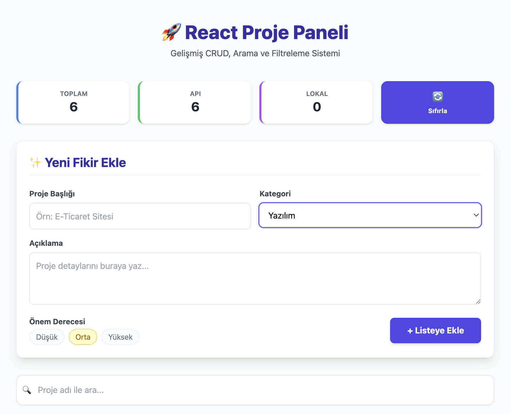
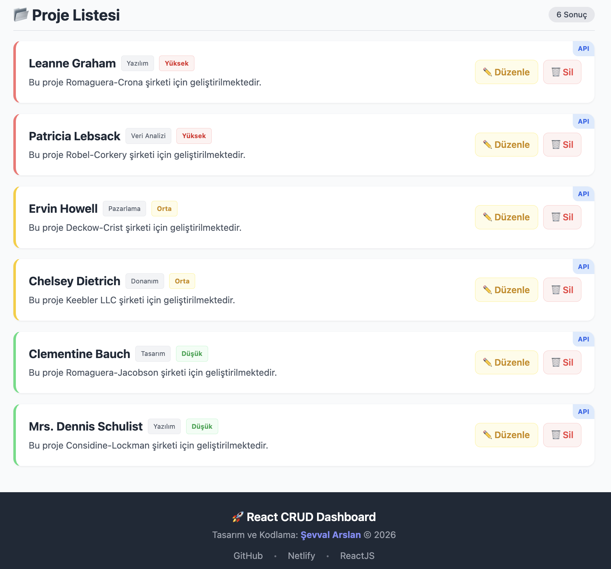
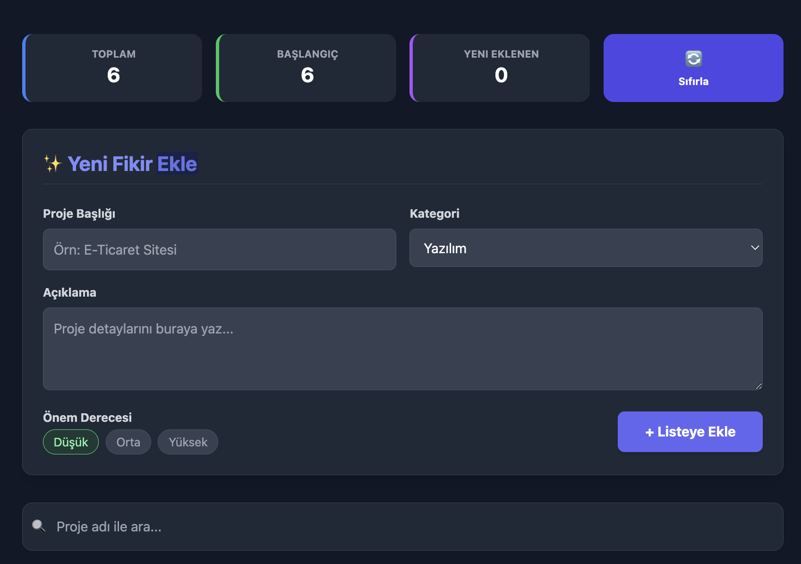

# 🚀 React Project Tracking & Management Panel

> A comprehensive CRUD application developed using ReactJS, Tailwind CSS, and modern JavaScript techniques as part of a **Web Development Training** program.



## 🔗 Live Demo
You can test the application here: [https://dancing-mermaid-e3f22e.netlify.app/](https://dancing-mermaid-e3f22e.netlify.app/)

---

## 🌟 About the Project

This application is a **Dashboard (Management Panel)** interface where users can record, edit, and track their project ideas. Unlike a standard "Todo App," it includes **API integration**, **advanced filtering**, **statistics**, and **persistent data management**.

## 🔥 Key Features

### 1. Advanced CRUD Operations
- **Add:** New projects can be added with a title, category, description, and priority level.
- **List:** Projects are listed in the form of cards.
- **Update (Edit Mode):** Professional editing is done **via a form** instead of `prompt`. When the edit button is pressed, the form is filled with the relevant data.
- **Delete:** Safe deletion is performed with a confirmation mechanism.

### 2. Smart Sorting and Filtering
- **Instant Search:** The list is filtered instantly based on the word typed into the search bar.
- **Priority Sorting:** Projects are automatically sorted by priority level (**High > Medium > Low**).



### 3. API Integration & Data Management
- **JSONPlaceholder API:** Initial data is fetched from the API.
- **Homogeneous Data Distribution:** Raw data coming from the API is assigned stable and ordered (homogeneous) categories and priority levels in accordance with the application's structure.
- **LocalStorage:** Added data is not lost even if the page is refreshed (State Persistence).

### 4. User Experience (UX)
- **Dark/Light Theme (Dark Mode):** Offers a modern theming experience that switches with a single click based on user preference and keeps the last state in browser memory (LocalStorage).
- **Dashboard Statistics:** Dynamic counters showing the total, API, and local data counts.
- **Loading State:** A "Loading" animation is shown to the user while data is being loaded.
- **Toast Notifications:** Informational messages appear in the top right corner on success/error states.



---

## 🛠️ Technologies Used

| Technology | Description |
|-----------|----------|
| **ReactJS** | Component-based architecture with Vite infrastructure |
| **Tailwind CSS** | Modern and responsive design |
| **JavaScript (ES6+)** | Async/Await, Map/Filter/Reduce, Destructuring |
| **LocalStorage API** | Browser-based data storage |
| **Fetch API** | Fetching data from external services |

---

## 📂 Folder Structure 

The project has a modular and scalable file structure:

```text
src/
├── Components/              # Reusable components
│   ├── ProjectForm.jsx       # Project add / update form
│   ├── ProjectList.jsx       # Component that renders the project list
│   ├── ProjectCard.jsx       # Displays each project card
│   ├── Stats.jsx             # Total, API, and local statistics
│   ├── Notification.jsx      # Notification display
│   └── Footer.jsx            # Page footer
│
├── Pages/                   # Page components and main logic
│   └── HomePage.jsx          # Dashboard, state management, and CRUD logic
│
├── Interfaces/              # Data models and type definitions
│   └── IProject.js           # Project data structure in JSDoc format
│
├── styles/                  # Style files (Tailwind / CSS)
│   └── index.css             # Global style definitions and Tailwind directives
│
├── assets/                  # Images and static files
│   └── (e.g.: logo.png, icon.svg)  
│
├── App.jsx                   # Main application wrapper (Router, etc.)
└── main.jsx                  # Application entry point
```
